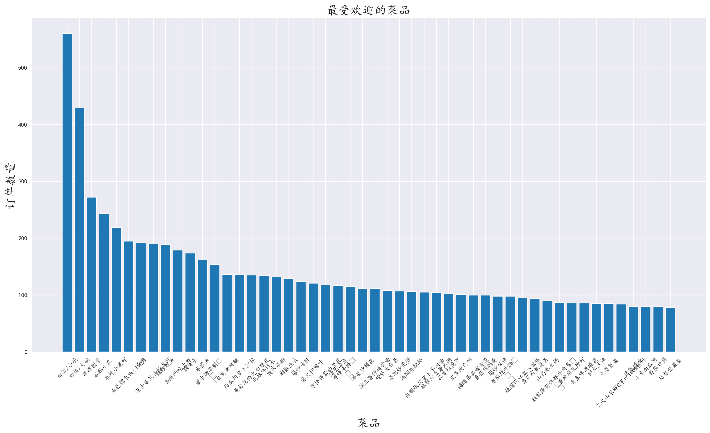
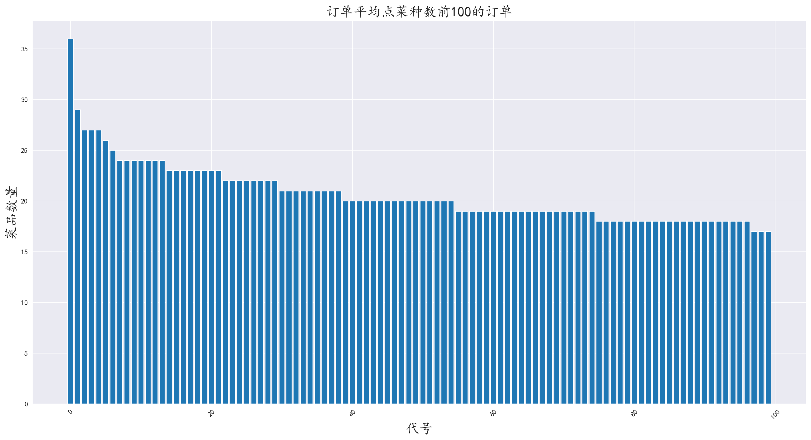
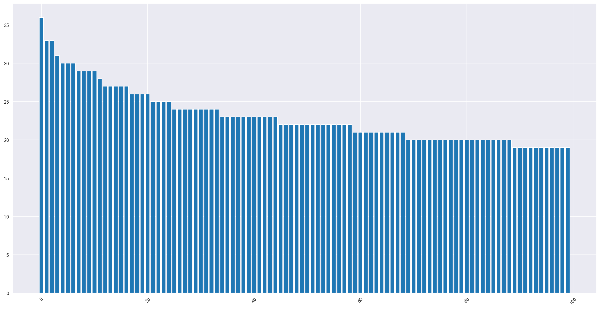
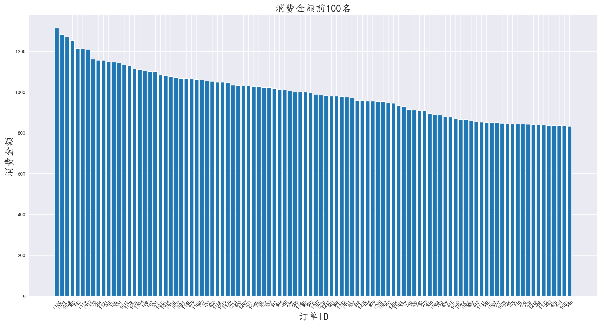
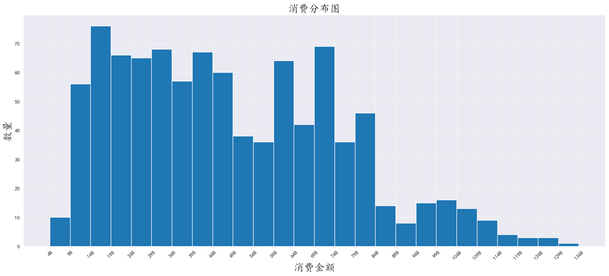
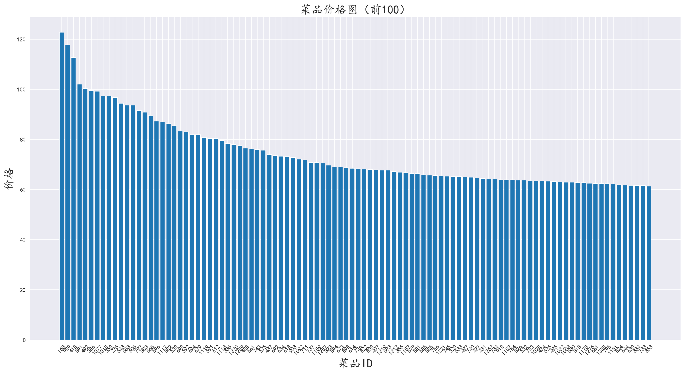
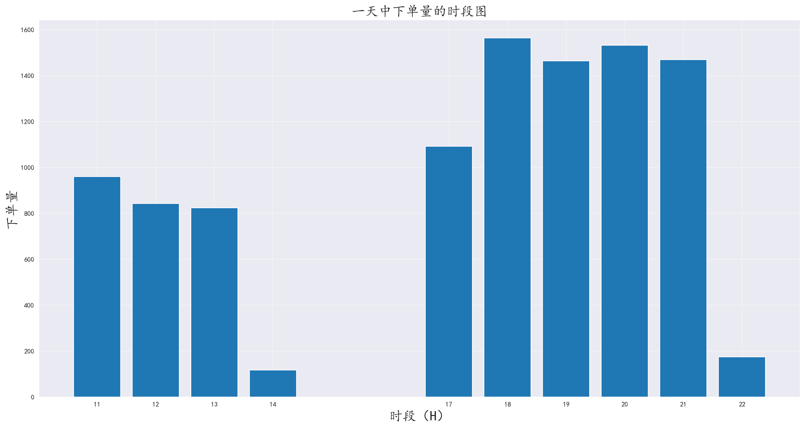
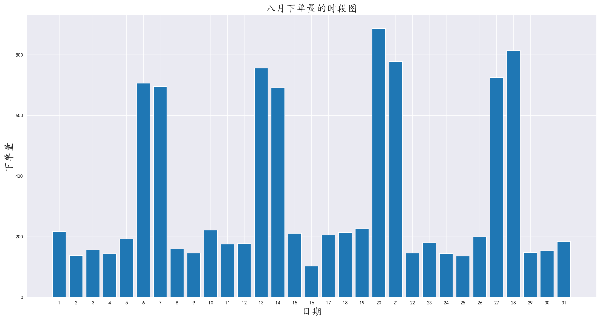
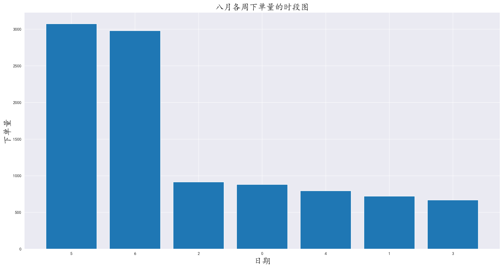

# 分析餐厅一个月的订单数据

## 1.需求分析

餐厅给出了他们八月份的订单数据，帮助他们分析订单，找出如何优化餐厅的营销政策

## 2.技术栈

#### 2.1 开发环境

- **操作系统**：Windows 11

- **开发工具**：Jupyter Notebook，PyCharm

- **版本控制**：Git

#### 2.2 编程语言和库

- **Python**：主要编程语言
  - **Pandas**：数据处理和分析
  - **Numpy**：数值计算
  - **Matplotlib**：数据可视化

#### 2.3 数据存储

- **Excel**：电子表格文件

#### 2.4 报告生成

- **Markdown**：编写文档和报告

## 3.数据分析

### 3.1 认识数据

给出的数据集为meal_order_detail.xlsx的excel文件，内有三个工作表，在数据导入阶段，需要将数据合并到一起  

观察数据发现许多列为空，在数据清洗阶段需要将无用的列删除

### 3.2 编程库导入和语言配置

```python
import pandas as pd
import numpy as np
import matplotlib.pyplot as plt
import matplotlib
# 设置全局中文格式
matplotlib.rc('font', family='KaiTi')
```

### 3.3 数据导入与数据清洗

**数据导入**：

```python
# 使用pandas的数据读取方法
pd.read_excel(filename, sheet_name)
```

依次读取三个工作表的数据

```python
# 使用concat方法，将数据合并
pd.concat(['data1', 'data2', ...], axis=0)
```

**数据清洗**：

将空列删除

```python
.dropna(axis=1, how='all', inplace=True)
```

### 3.4 分析最受欢迎的菜品

对菜品进行分组聚合，利用matplotlib工具可视化展示最受欢迎的菜品

```py
.groupby('dishes_name')['counts'].sum().sort_values(ascending=False)

'''
图形化...
'''
```



通过图表发现，米饭的数量最多，符合大众点菜习惯

可以将米饭纳入套餐中，进行捆绑消费


### 3.5 分析点菜种类的数量

对订单ID进行分组，取出菜品ID聚合并进行可视化

```py
groupby(by='order_id')['dishes_id'].count().sort_values(ascending=False)[:100]
```



由于订单数量众多，只显示前100

可见前一百的订单点菜种数大都集中在20种菜左右

而平均点菜种数，却只有10种菜，说明大多数订单点菜数量还是集中在10种菜以下

### 3.6 分析点菜数量最多的订单

对订单ID进行分组，取出数量进行聚合并进行可视化

```python
data.groupby(by='order_id')['counts'].sum().sort_values(ascending=False)
```



由于订单数量众多，只显示前100

可见前一百的订单点菜数量大都集中在25道菜左右

而平均点菜种数，却只有12道菜，说明大多数订单点菜数量还是集中在12道菜以下

### 3.7 分析平均消费

为了方便，将ID，点菜数量，菜品价格，和总价创建为一个新表

```python
data['total_price'] = data['counts'] * data['amounts']

dataGroup = data[['order_id', 'counts', 'amounts', 'total_price']].groupby(by='order_id').sum()
```

对消费总价进行分组排序，并绘制图表

```python
dataGroup['total_price'].sort_values(ascending=False)
```





通过条形图发现，前100名平均为1000元左右

根据直方图发现，高消费数量很少，多数顾客消费大约在100~800之间，可以针对此类用户进行消费满减。或者安排同等价位的优惠套餐，以增加客户满意度和回头率

### 3.8 分析菜品价格

对菜品均价进行分组聚合，并绘制图表

```python
dataGroup['average_price'].sort_values(ascending=False)

print(f"菜均金额为：{dataGroup['average_price'].mean().round(2)} 元")
# 菜品均价为41.99元
```



平均菜品均价为41.99元，而消费前100的客户菜品均价维持在70元左右，说明主力消费人群以一般家常菜为主，可以针对进行菜品优惠，或者买一送一和捆绑消费

### 3.9 分析每段时间点餐数量

分析数据发现，数据中的时间数据不为datetime类型，需要对其进行转换

```python
data['Time'] = pd.to_datetime(data['place_order_time'])
```

取出小时单位，进行一天的数据分析

```python
data['period'] = data['Time'].map(lambda element: element.hour)
```

对数据进行分组聚合，并绘制图像

```python
data.groupby(by='period').count()['order_id']
```



通过图发现，主要消费时间段为11点~13点和17点~21点

时间段符合饭点规律，并且发现晚上的订单要比白天要多，猜测餐厅地段属于夜生活丰富的地段，或者上班族较多的地带，一般下班后来聚餐

可以针对夜晚进行促销，但也不要放弃白天的营业，可以在夜晚消费后，发放白天就餐的优惠券，引导顾客白天消费的动力，平衡两次饭点的就餐人数

### 3.10 查看一个月中哪天的订单最多

取出天的时间单位，对其进行分组聚合，并绘制图表

```python
data['day'] = data['Time'].map(lambda element: element.day)

day_count = data.groupby(by='day').count()['order_id']
```



通过图发现，消费集中在一周的周末时间段，说明人们在周末往往会选择下馆子在犒劳工作一周的自己

商家可以加大对周末的优惠力度，以及人手安排，以应对周末暴增的订单数量

### 3.11 查看每个星期的下单量

对星期的维度进行分组聚合，并绘制图表

```python
data['week'] = data['Time'].map(lambda element: element.weekday())
weekday_count = data.groupby(by='week').count()['order_id'].sort_values(ascending=False)
```



通过图不难发现，在月末的订单量比平时更多，说明月末人们发完工资之后，往往会与朋友家人下馆子

商家可以针对月末实施一些优惠政策，或者一些活动以增加客户粘度

## 4.总结分析

**通过对餐厅一个月的数据分析，发现可以改进的方面**

- **菜品维度**：对销量高的菜品纳入套餐中，并将销量低的菜品进行捆绑消费，对于点菜数量高的订单，进行买一送一

- **消费者维度**：实行满减政策，应对不同价位的消费者
- **天维度**：对夜晚消费的客户发放白天的优惠券，引导客户白天消费，平衡两次饭点的订单数量，针对夜晚消费的客户可以进行酒水促销
- **星期维度**：对周末进行一定的促销，并在周末订单激增的情况加派人手，同时加大优惠力度
- **月维度**：针对月末进行优惠，在月末消费的客户，发放下个月月初的优惠券，增加顾客粘度

