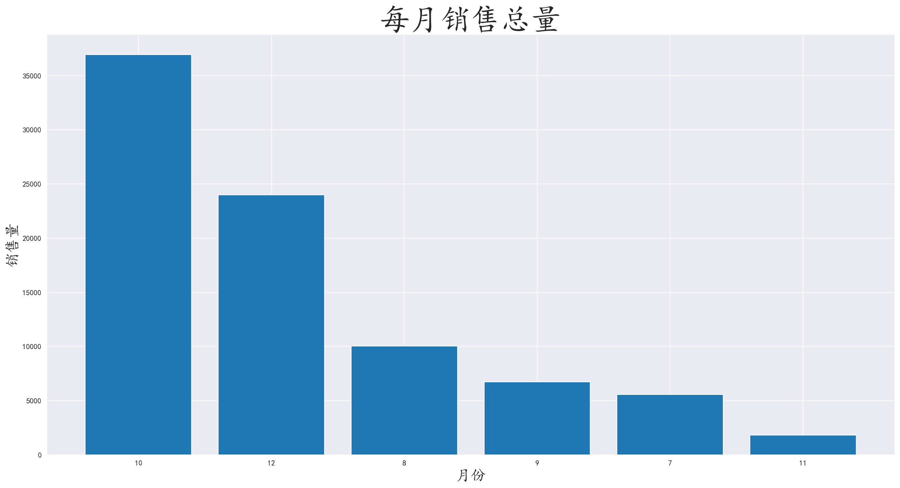
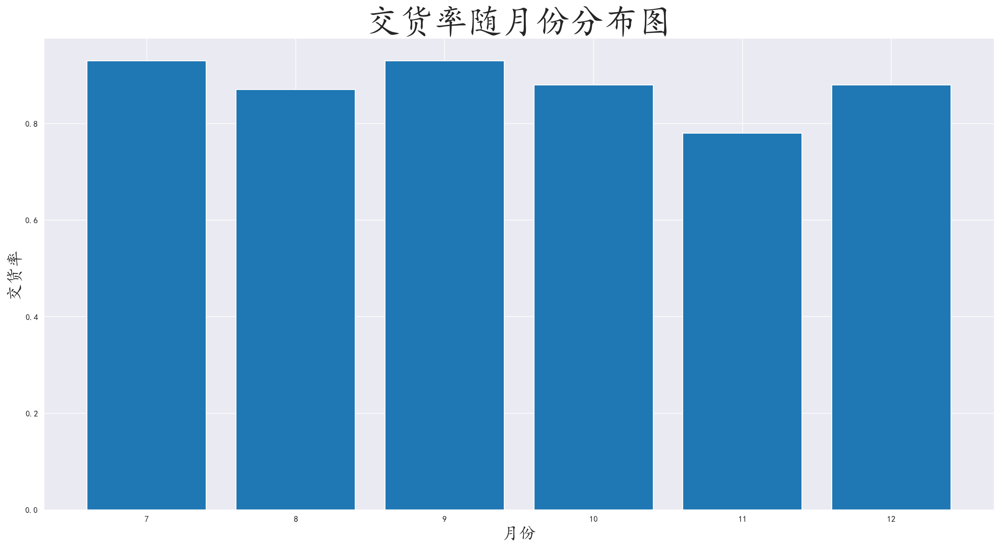
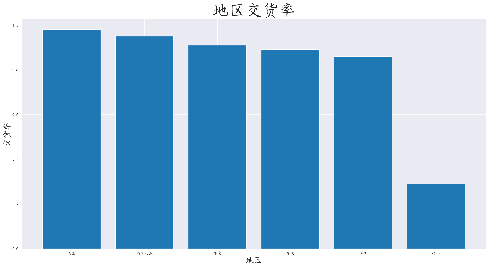
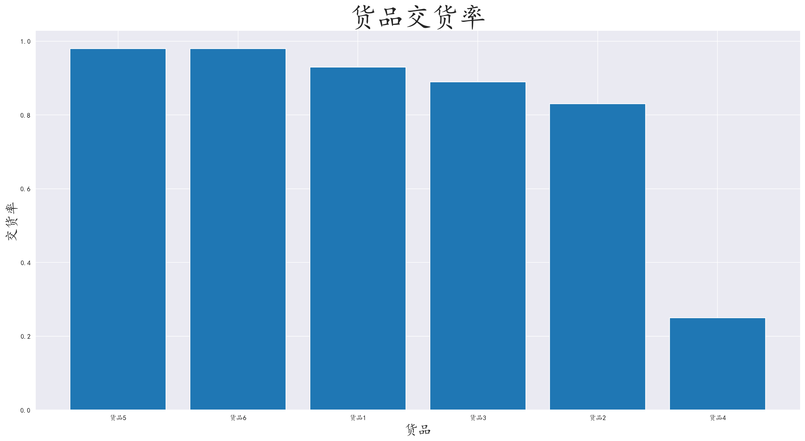
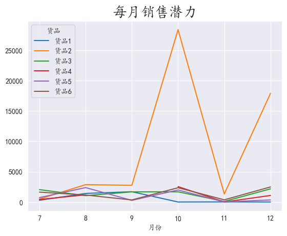
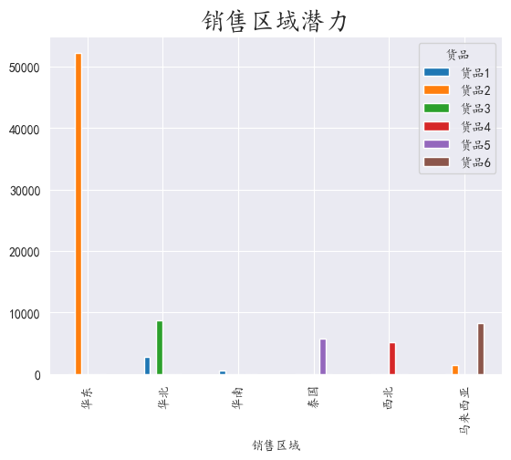
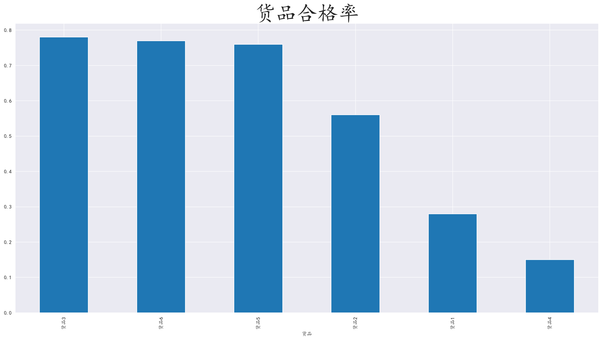

## 1.需求分析

某快递物流公司给出了半年的物流数据信息，帮助他们找出物流运输方面的缺点和提升建议

<!-- more -->

## 2.技术栈

#### 2.1 开发环境

- **操作系统**：Windows 11

- **开发工具**：Jupyter Notebook，PyCharm

- **版本控制**：Git

#### 2.2 编程语言和库

- **Python**：主要编程语言
  - **Pandas**：数据处理和分析
  - **Numpy**：数值计算
  - **Matplotlib**：数据可视化

#### 2.3 数据存储

- **CSV**：平面文件存储

#### 2.4 报告生成

- **Markdown**：编写文档和报告

## 3.数据分析

### 3.1 认识数据

给出的文件为CSV文件，使用read_csv进行读取，观察发现，数据中存在订单号为空的数据，以及金额单位不统一，有”元“和”万元“两种单位，而时间格式不是datetime格式，“货品交货状况”一列中存在首部空格。

对于整体数据而言，数据列：”订单行“对本次数据分析起不到作用，此外，数据中还存在重复数据，需要去重。

在数据清洗阶段需要对上述存在的数据问题进行处理。

### 3.2 编程库导入和语言设置

```python
import pandas as pd
import numpy as np
import matplotlib.pyplot as plt
import matplotlib
# 设置matplotlib的中文格式
matplotlib.rc('font', family='KaiTi')
```

### 3.3 数据导入和数据清洗

**数据导入**

使用pandas的read_csv读入数据

```python
# 若数据集的格式不是utf-8则需要自行指定格式，如：gbk...
pd.read_csv(filename, encoding='')
```

**数据清洗**

对数据使用.info()查看数据详情，发现有空数据列的空数据较少，并且空数据全部集中在订单号，对其进行填充无意义，所以将空行直接删除，而对于”订单行“的冗余数据也是选择直接删除

```python
data.dropna(axis=0, how='any', inplace=True)
data.drop('订单行', axis=1, inplace=True)
```

对于重复数据，进行去重操作

```python
# 删除重复数据
data.drop_duplicates(keep='first', inplace=True)
```

对于金额列存在数值单位不统一的情况，例如：1052,75元和11,50万元。

使用相应算法将其统一：

取出每一列数据，使用strip()去除尾部的”元“

使用split()将数据按照逗号分隔为列表，使用map()对列表组装

使用map()将”万“转化成”0000“接入数据尾部，并将数据转化为int64类型

```python
# 数据清洗，将object类型的价格转化为int
sell_data = data['销售金额'].str.strip('元')

sell_data_combine = sell_data.str.split(',').map(lambda element: element[0] + element[1])

data['销售金额'] = sell_data_combine.map(lambda element: element[:-1] + '0000' if element[-1] == '万' else element)

data['销售金额'] = data['销售金额'].astype('int64')

# 重置索引
data.reset_index(drop=True, inplace=True)
```

将数据有首部空格的列的空格去除，将金额为0的数据去除

```python
# 去除首字空格
data['货品交货状况'] = data['货品交货状况'].str.strip()

data = data[data['销售金额'] != 0]
```

由于该行业存在二八定律，不需要对极端值进行处理，保留即可

### 3.4 分析哪个月销售量最高

对日期去除月份单独成列，方便分析

```python
# 取出月份，单独为一列辅助列
data['销售时间'] = pd.to_datetime(data['销售时间'])
data['月份'] = data['销售时间'].map(lambda element: element.month)
```

对月份进行分组，取出数量进行聚合，并可视化数据

```python
sell_num = data.groupby(by='月份')['数量'].sum()
sell_num_sort = sell_num.sort_values(ascending=False)
```



对于销售量而言，可以针对销售量多的月份，使用更多的人手和运输工具，确保不会出现货品积压，发放困难的问题

### 3.5 分析月份交货率

按照月份和交货情况进行分组，计算交货率，并进行可视化

```py
# 根据月份和交货情况分组
receive_situation = data.groupby(by=['月份', '货品交货状况']).size().unstack()

# 计算交货率：
receive_situation['交货率'] = (receive_situation['按时交货'] / (receive_situation['按时交货'] + receive_situation['晚交货'])).round(2)
```



按照月份来看整体交货率没有太大问题

### 3.6 分析地区交货率

对销售区域和交货情况进行分组，计算交货率，并进行可视化

```py
receive_situation_area = data.groupby(by=['销售区域', '货品交货状况']).size().unstack()

# 计算交货率：
receive_situation_area['交货率'] = (receive_situation_area['按时交货'] / (receive_situation_area['按时交货'] + receive_situation_area['晚交货'])).round(2)
successful_percent = receive_situation_area['交货率'].sort_values(ascending=False)
```



我们发现在地区交货率上存在很大问题，西北地区的交货率和其他地区的交货率相差巨大，而海外地区的交货率和内地地区差不多

可以分析出，这个快递物流公司很大概率位于东南沿海地区，而西北地区距离远，路况不是很好，往往很大概率因为时间问题没有交货

可以按需要结合成本改变西北地区的物流方式，可以尝试通过铁路和空中物流的方式进行运输。

### 3.7 分析商品交货率

对货品和货品交货状况进行分组，计算交货率后进行可视化

```py
receive_situation_product = data.groupby(by=['货品', '货品交货状况']).size().unstack()

# 计算交货率：
receive_situation_product['交货率'] = (receive_situation_product['按时交货'] / (receive_situation_product['按时交货'] + receive_situation_product['晚交货'])).round(2)
successful_percent = receive_situation_product['交货率'].sort_values(ascending=False)
```



我们发现货品4的交货率相对于其他货品差距巨大

猜测货品4可能为大型商品，或者生鲜时蔬等物品

可以对大型货品或者生鲜时蔬进行特定的运输方式，或者优化这类物品的物流路线

### 3.7 分析月份销售潜力

按照月份和货品进行分组，取出数量进行聚合并展开，对数据进行可视化

```py
# 按照月份
month_sell_ability = data.groupby(by=['月份', '货品'])['数量'].sum().unstack()
```



我们发现，除了10月和12月的商品2，其他月份和商品具有很大的销售潜力

可以对这几个月进行物流费用的优惠，或者活动来吸引顾客或者商家使用我物流公司的服务，或者针对商品推出优惠，或者针对性服务。

### 3.8 分析区域销售潜力

对销售区域，商品进行分组，取出数量进行聚合，可视化出数据

```py
# 按照地区
area_sell_ability = data.groupby(by=['销售区域', '货品'])['数量'].sum().unstack()
```



根据图中数据可知，每个地区都有其”特供“商品

对于地区的”特供“商品，针对性的推出特点的服务，例如对于海外地区，可以推出优惠航空速运服务，等等措施。

对于华东区域的大客户，可以对相应区域提供永久性的特惠，稳定客户数量。

### 3.9 分析货品是否存在质量问题

对货品和用户反馈进行分组聚合，按照不同的反馈（质量合格，返修，拒货）计算出货品合格率，并可视化数据

```py
# 分析货品是否存在质量问题
quality = data.groupby(by=['货品', '货品用户反馈']).size().unstack()
quality.fillna(0, inplace=True)
quality['qualified_percent'] = (quality['质量合格'] / (quality['质量合格'] + quality['返修'] + quality['拒货'])).round(2)
qualified_percent = quality['qualified_percent'].sort_values(ascending=False)
```



发现货品2，1，4存在质量问题，猜测可能是易碎或者易腐烂物品

对于物流方面，可以对易碎物品加装更多的保护措施，而对于易腐烂物品，可以提升保质措施，或者加快货品运输速度。

对于货源方面，对那些货品极度不合格的商家拒绝继续物流合作，或者加收服务费

对于人员方面，不排除物流工作人员的玩忽职守，破坏了物品。针对物流工作人员加强培训和薪资待遇，减少临时工的任用。

## 4. 总结分析

**对物流数据进行分析之后，有以下可改进的方面：**

- **对销量方面**：针对销量高的地区实行针对性的优惠政策和惠民服务，保持主要客户；对于一些淡季推出特惠服务，和折扣政策

- **对于时效性方面**：优化西北地区的物流方式，采用铁路或者空中物流

- **对于保持合格率方面**：减少与不合格商家的合作或者对易碎易腐烂物品加收服务费，但也相对应的增加一些保值服务和保险服务。减少临时工任用，加强在岗职工的培训和待遇。

