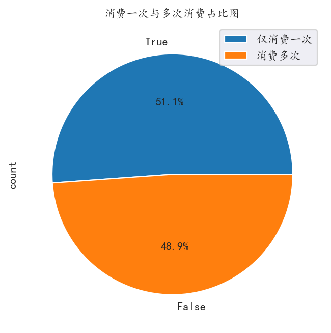

## 1. 需求分析

一商店给出刚开业时1997.1~1998.6共18个月的用户消费数据，要求分析这段时间的用户消费行为，给出相应建议

<!-- more -->

## 2.技术栈

#### 2.1 开发环境

- **操作系统**：Windows 11

- **开发工具**：Jupyter Notebook，PyCharm

- **版本控制**：Git

#### 2.2 编程语言和库

- **Python**：主要编程语言
  - **Pandas**：数据处理和分析
  - **Numpy**：数值计算
  - **Matplotlib**：数据可视化

#### 2.3 数据存储

- **TXT**：纯文本文件

#### 2.4 报告生成

- **Markdown**：编写文档和报告

## 3.数据分析

### 3.1 认识数据

给出的数据存储在txt文件中，一共四列分别为：用户ID，购买时间，购买数量，购买金额

数据干净整洁，只需要处理时间数据，将其格式转换为datetime类型。

### 3.2 编程库导入和语言设置

```py
import pandas as pd
import numpy as np
import matplotlib.pyplot as plt
import matplotlib

matplotlib.rc('font', family='KaiTi')
```

### 3.3 数据导入和数据规整

使用pandas的read_table(filename, columns, sep)读取数据

```py
columns = ['user_id', 'order_dt', 'order_products', 'order_amount']
df = pd.read_table('../dataSets/3.User_consumption_behavior/CDNOW_master.txt', names=columns, sep='\\s+')
# 数据直接以数量不唯一的空格为界，sep的值为\\s+
```

将时间数据转换为datetime类型

```py
df['order_dt'] = pd.to_datetime(df['order_dt'], format='%Y%m%d')
```

之后的分析使用的最小时间精度为”月“，将精度降为”月“方便后续处理

```py
# 现版本中，period类型已经不能进行重采样，若后续有类似操作，需要转为datetime
df['order_time'] = df['order_dt'].dt.to_period('M')
```

### 3.4 按月分析销售数量、金额、次数、人数

对月份进行分组，分别取出上述字段进行聚合，并进行可视化

```py
# 每月购买数量
consume_num = df.groupby(by='order_time')['order_products'].sum()
# 每月购买总金额
consume_sum = df.groupby(by='order_time')['order_amount'].sum()
# 每月销售次数
consume_count = df.groupby(by='order_time')['user_id'].count()
# 每月销售人数
consume_person = df.groupby(by='order_time')['user_id'].apply(lambda x: len(x.drop_duplicates()))
```


我们发现，无论是消费数量，金额，次数，人数等都只是在商店开业时达到顶峰，而后续客户流失现象较为严重

### 3.5 分析用户消费金额和数量的关系

对用户ID进行分组，取出消费金额字段和消费次数字段进行聚合，绘制散点图

```py
user_consume = df.groupby(by='user_id')[['order_products', 'order_amount']].sum()
```


我们发现，购买金额和数量成正比关系

图中还表明消费客户大都集中在购买100件以内商品，而购买100件以上的客户占比很少

### 3.6 分析购买数量和购买金额的主力人群

对上一组数据直接进行绘图


两幅图形状大致相同，说明二者存在正比关系，并且印证了上一组数据透露的说法，大多数用户只是消费100件以内的商品

### 3.7 分析用户消费贡献度

计算出消费总金额，对每个用户消费金额进行升序排序，得出单个用户的消费金额

对用户的消费贡献度进行累加，将其除以总金额，得出前n名用户的消费贡献度，绘制散点图

```py
# 计算出总消费金额
total_amount = df['order_amount'].sum().round(2)

user_consume.sort_values(by='order_amount', inplace=True)
# 累加
user_consume['user_cumsum'] = user_consume['order_amount'].cumsum()

user_consume['consume_donation'] = user_consume['user_cumsum'] / total_amount
```


图中呈现了指数上升的趋势，说明消费高的较少用户贡献了大部分的消费金额（二八定律）

### 3.8 分析各个时间首购用户数量

对用户ID进行分组，取出消费时间的最小值进行聚合，绘制折线图

```py
user_first_buy = df.groupby(by='user_id')['order_dt'].min().value_counts()
```


图中右侧首购数量较左侧更高，这与 3.4 部分的数据恰恰相反

说明刚开业时首次购买的用户，消费金额和数量等数据十分的高，导致即使后续首购用户比开始时多，但在金额和数量方面仍然比不上

侧面说明了，后续购买的客户购买数量和购买金额普遍较低，猜测后续可能出现了商店口碑出问题，导致后续用户消费积极性大减

### 3.9 分析各个时间最后一次购买用户的数量

和 3.8 部分相同，取时间的最大值

```py
user_first_buy = df.groupby(by='user_id')['order_dt'].max().value_counts()
```


我们发现在开业之后不久，大量第一波用户不再购买，但是后续最后一次购买的客户数量减少，说明商店已经形成了较为稳定的客流，没有出现大量的客户流失现象

## 4. 深入分析——用户分层（RFM模型）


### 4.1 使用透视表分析数据，并将用户分层

透视表pivot_table相当于对一个数据进行分组，取出多列数据分别处理之后聚合到一起

```py
# 使用透视表
rfm = df.pivot_table(index='user_id',  # 相当于groupby('user_id')分组
                     values=['order_amount', 'order_products', 'order_dt'], # 相当于取出哪些列
                     aggfunc={'order_dt':'max', # 最后一次购买 
                              'order_amount':'sum', # 消费总额
                              'order_products':'sum'}) # 消费数量
```

**用户分层**

对于取出的数据减去平均值后与1进行比较，分别得出R、F、M三个值，将其与模型对于，得出用户类型

```py
def rfm_func(x):
    level = x.apply(lambda x: '1' if x >= 1 else '0')
    label = level['R'] + level['F'] + level['M']
    table = {
        '111':'重要价值客户',
        '110':'一般价值客户',
        '011':'重要保持客户',
        '010':'一般保持客户',
        '101':'重要发展客户',
        '100':'一般发展客户',
        '001':'重要挽留客户',
        '000':'一般挽留客户',
    }
    result = table[label]
    return result
    

rfm['R'] = (rfm['order_dt'].max() - rfm['order_dt'])/np.timedelta64(1, 'D')
rfm.rename(columns={'order_amount':'M', 'order_products':'F'}, inplace=True)
rfm['label'] = rfm[['R', 'F', 'M']].apply(lambda x: x-x.mean()).apply(rfm_func, axis=1)
```

对得出的标签进行分组，使用循环分别绘制散点图，得出客户类型分布图

```py
plt.figure(figsize=(20, 8), dpi=160)
for label, grouped in rfm.groupby(by='label'):
    x = grouped['F']
    y = grouped['R']
    plt.scatter(x, y, label=label)
```


通过分布图来看，我们有许多的重要保持客户，需要维持他们的购物积极性

同时我们的重要价值客户也较多，需要对其进行针对性优惠政策

当然也不要放弃其他客户，在节假日多进行相对应的活动，定时发放优惠券，保持客户活跃度

### 4.2 客户消费行为分析

根据客户的行为，分为：积极、新、回流、不积极等四种用户

除了这四种，还有未注册用户，这些用户在第一次消费之前的时段内都被称为未注册用户

积极用户：连续消费

新用户：第一次消费

回流用户：之前有过消费，长时间未消费之后的第一次消费

不积极：不消费

使用透视表进行分析，对用户ID进行分组，取出日期，填充布尔值

```py
pivot_counts = df.pivot_table(index='user_id',
                              columns='order_time', # 将月份排列成列
                              values='order_dt',
                              aggfunc='count').fillna(0)
df_purchase = pivot_counts.map(lambda x: 0 if x == 0 else 1)
```

根据四种用户行为的定义，制定算法使用apply应用于一行数据

```py
def purchase_func(data):
    status = [] # 用户状态：unreg/ active/ inactive/ return/ new
    for i in range(18):
        if data.iloc[i] == 0: # 本月没有消费
            if len(status) == 0:
                status.append('unreg')
            else:
                if status[i - 1] == 'unreg':
                    status.append('unreg')
                else:
                    status.append('inactive')
        else: # 本月有消费
            if len(status) == 0:
                status.append('new')
            else:
                if status[i - 1] == 'unreg':
                    status.append('new')
                elif status[i - 1] == 'inactive':
                    status.append('return')
                else:
                    status.append('active')
    return pd.Series(status, df_purchase.columns)
    

purchase_status = df_purchase.apply(purchase_func, axis=1)
```

对未注册用户赋值NAN，并对数据进行聚合和可视化

```py
purchase_status_count = purchase_status.replace('unreg', np.nan).apply(lambda x: x.value_counts())
purchase_status_count.fillna(0, inplace=True)
```


根据图中发现和3.9部分的数据大致相同

一开始有大量的新用户，而开始的新用户不再消费，后逐渐形成稳定的用户群体

对于这种情况，可以对消费的用户发放下一次购物的优惠券，以此增加客户粘性，以及增加一个回归用户活动，对回归用户进行一定的折扣，或附赠礼品，使得回流用户逐渐变成稳定用户

### 4.3 分析回归用户和活跃用户的变化

采用占比的形式绘制折线图会更加直观

```py
rate = purchase_status_count.apply(lambda x: (x/x.sum()), axis=1)
```


根据图中反映了一个问题，回归用户的占比在后期比活跃用户高

说明回归用户后续也没有再次购买，说明商家对回归用户没有相对应的措施，使其变成活跃用户，对回归用户进行回归奖励和优化来进行客户类型转换

### 4.4 分析用户消费周期

对用户ID进行分组，取出时间列，使用shift()方法，对每个用户的消费时间进行错位相减，得出用户消费与消费直接的时间差，也就是用户消费周期，绘制图形

```py
order_diff = df.groupby(by='user_id')['order_dt'].apply(lambda x: x - x.shift())
```


我们发现消费周期在25天大概一个月的用户占比大多数，也就是这些用户每个月消费一次，较为稳定

可以将其转为跟频繁的消费客户，但也可以每月举行一次优惠酬宾活动，来逐渐稳定这些人群，不一定要让他们每天都消费，可能稳定每月消费一次的用户也值得挽留

### 4.5 分析用户的生命周期

通过对用户最后一次购买日期减去第一次购买日期得出生命周期，对这些客户进行可视化

```py
order_period = df.groupby(by='user_id')['order_dt'].apply(lambda x: x.max() - x.min())

(order_period / np.timedelta64(1, 'D')).plot(kind='hist', bins=20)
plt.title('所有用户的生命周期', fontsize=20)

u_1 = order_period[order_period / np.timedelta64(1, 'D') > 0]
(u_1 / np.timedelta64(1, 'D')).plot(kind='hist', bins=15)
plt.title('多次购买用户的生命周期', fontsize=15)
```


我们发现，只够买几次的客户是长期购买客户的十倍之多

这也是符合客观规律，我们需要做的只是保持后期稳定的客户流，对于长期购买的客户，我们也需要对其进行定期优惠，如节假日给予消费现金抵押券等。

根据上述大量的分析，我们不难发现，其客户人群中存在大量的一次购物情况，但不清楚数量有多少，需要对其针对性分析

**多次消费与一次消费分析**

使用布尔索引，第一次购买日期和最后一次购买日期相同的为一次购买用户

```py
order_life = df.groupby(by='user_id')['order_dt'].agg(['max', 'min'])
plt.figure(dpi=160)
(order_life['max'] == order_life['min']).value_counts().plot.pie(autopct='%1.1f%%')
```



消费一次的人群占比一半以上，消费一次的人群对于商店来说有巨大的潜力

可以对到店的新用户发放下次购买的优惠券或者抵押券，以此增加客户粘性

### 4.6 复购率分析

复购用户：以月为单位，单月多次购买的用户

使用map结合lambda函数对数据中的每一项数据进行分析

```py
# 复购用户：1 非复购用户 0 未消费用户：NaN
reorder_data = pivot_counts.map(lambda x: 1 if x > 1 else np.nan if x == 0 else 0)
reorder_users = reorder_data.sum() # 复购用户
order_users = reorder_data.count() # 参与购物的用户
```


图中看出在开店之后，复购率回升且稳定在20%~22%之间，说明商店稳定客户占比总客户的五分之一，在客户保持方面没有太大问题

### 4.7 回购率分析

回购用户：本月购买，且下个月也购买的用户

需要对数据行使用apply和自定义函数进行计算，根据回购的定义制定相应的算法

```py
# 当月有购买，下个月也有购买 为1
# 当月有购买，下个月没有购买 为0
# 当月没有购买，为nan
def return_order(data):
    status = []
    for i in range(18):
        if i == 17:
            status.append(np.nan)
            break
        if data.iloc[i] == 1: # 当月有购买
            if data.iloc[i + 1] == 1: # 下个月也有购买
                status.append(1)
            else: # 下个月没有购买
                status.append(0)
        else:# 当月没有购买
            status.append(np.nan)
    return pd.Series(status, df_purchase.columns)


return_order_data = df_purchase.apply(return_order, axis=1)
return_order_num = return_order_data.sum() # 回购用户
order_num = return_order_data.count() # 参与购物用户
```

与复购率的图一起分析


回购率在复购率之上，说明还是有大部分用户虽然不是较为活跃的用户，但也是商店的潜在消费人群，说明商店的营销没有太大问题。

## 5. 总结分析

**对该商店的数据进行分析，有以下发现：**

- 商店整体营销没有太大问题
- 需要对黏住新客户，可以对新客户发放下一次购物的优惠券和抵押券
- 对于回归用户，对其进行回归优惠，或者附赠小礼物，增加回归用户的归属感
- 对于稳定但不活跃的用户，可以定期进行活动，或者在节假日进行满减活动
- 对于长期购物的老客户，可以发放终身优惠券，或者逢年过节给予免费额度
