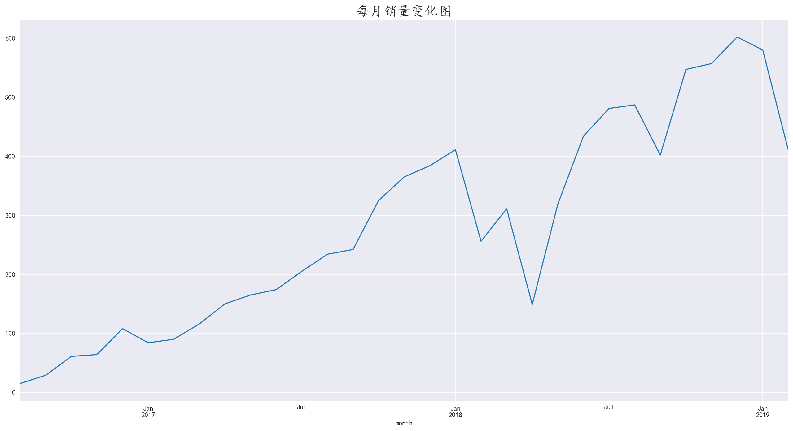
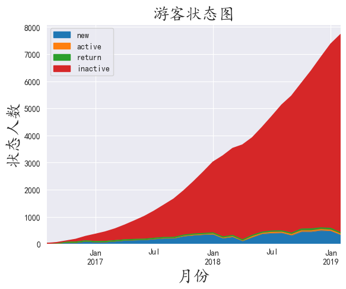
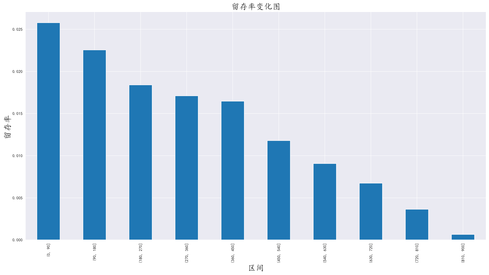

## 1. 需求分析

台北101观景台提供了从2016.8~2019.2的门票售出数据，分析景点的数据，得出游客的行为规律，以及景点能够改进的地方。

<!-- more -->

## 2.技术栈

#### 2.1 开发环境

- **操作系统**：Windows 11

- **开发工具**：Jupyter Notebook，PyCharm

- **版本控制**：Git

#### 2.2 编程语言和库

- **Python**：主要编程语言
  - **Pandas**：数据处理和分析
  - **Numpy**：数值计算
  - **Matplotlib**：数据可视化

#### 2.3 数据存储

- **CSV**：平面文件存储

#### 2.4 报告生成

- **Markdown**：编写文档和报告

## 3.数据分析

### 3.1 认识数据

数据存储在CSV文件中，数据干净

使用info()查看数据，发现没有数据缺失，只需要将时间类型转为datetime

### 3.2 编程库导入和语言设置

```py
import pandas as pd
import numpy as np
import matplotlib.pyplot as plt
import matplotlib

matplotlib.rc('font', family='KaiTi')
```

### 3.3 数据导入和数据规整

使用pandas的read_csv读取数据

```py
df = pd.read_csv(filename)
```

将时间转为datetime类型

```py
df['time'] = pd.to_datetime(df['time'])
```

### 3.4 分析每天的销售数据

对时间进行分组，取出频数进行聚合，绘制图表

```py
daily_sell_num = df.groupby(by='time').count()['frequency']
```


我们发现每日销售数据，整体上呈现上升趋势

而在2018年中旬时，出现了下跌，可能是由于景区内部或者其他因素影响导致销量下跌

### 3.5 分析每月销售数据

将月份单独列出，方便后续分析，对其进行分组聚合，绘制图表

```py
df['month'] = df['time'].dt.to_period('M')

df.groupby(by='month').count()['frequency'].plot()
```



月份维度的销量图是每日销量的折射，大体上和每日销量无异

而销量的突然下跌应该不属于景区原因，而是外界的因素，因为大体趋势都是不断攀升的趋势，如果景区有问题则不会有这种趋势

### 3.6 分析购买量和金额的关系

对游客ID进行分组，分别对购买频数和金额进行聚合

得到的两个表使用merge()进行组合，绘制图形

```py
# 分组每个游客的购买次数
visitor_order_count = df.groupby(by='author')['frequency'].count().reset_index()

# 分组每个游客的购买金额
visitor_order_sum = df.groupby(by='author')['amount'].sum().reset_index()

# 将两个表组合
visitor_order_data = pd.merge(left=visitor_order_count, right=visitor_order_sum, on='author')
```


这个图的分布呈现为一条标准的直线

说明这些年来，景区的价格一直没有改变，或者没有进行任何的优惠

### 3.7 分析旅客门票购买次数

取出 3.6 数据源的频数列直接绘图

```py
visitor_order_data['frequency'].plot(kind='hist', bins = 20)
```


我们发现大量的有何集中在购买一次

这也符合客观规律，对于一般游客来说，景区只去一次就足够

### 3.8 分析购买次数大于一次的旅客

使用布尔索引，选出购买次数大于一的旅客进行分析

```py
order_multiple = visitor_order_data[visitor_order_data['frequency'] > 1]
```


猜测这部分的旅客应该是景区周边的居民，或者去过一次之后，携带朋友亲人再去一次的旅客，而大部分也是集中在2次。

**绘制对比图**


无论是1~5次还是2~5次，买1~2次门票的旅客还是占据了绝大多数

这是旅游景点的客观现象

### 3.9 分析复购率

使用透视表，并根据复购率的定义，绘制出是否复购的布尔数据，并绘制图表

```py
review_user = df.pivot_table(index='author',
                       columns='month', 
                       values='frequency',
                        aggfunc='count').fillna(0)
review_user_data = review_user.map(lambda x: 1 if x > 1 else 0 if x == 1 else np.nan)

total_num = review_user_data.count() # 参与人数
review_num = review_user_data.sum() # 复购人数
review_percent = review_num / total_num
```


虽然整体数据的波动很大，但是复购人数和复购率在数据上十分低，人数基本是个位数，占比也是千分之一

所以说景区和商店有所不同，商店需要增强客户粘度，而景区需要不断吸收新旅客，因为同一地点去多次的旅客数量极低

景区需要对于新旅客进行宣传。


### 3.10 分析回购率

根据回购率的定义，制定相关算法，使用apply应用于每一行数据

```py
def return_func(data):
    status = []
    for i in range(data.shape[0] - 1):
        if data.iloc[i] >= 1: # 这个月有购买
            if data.iloc[i+1] >= 1: # 下个月还有购买
                status.append(1)
            else: # 下个月没有购买
                status.append(0)
        else:
            status.append(np.nan)
    status.append(np.nan)
    return pd.Series(status, review_user.columns)


return_data = review_user.apply(return_func, axis=1)
return_num = return_data.sum() # 回购人数
total_return_num = return_data.count() # 参与购买人数
return_num_percent = return_num / total_return_num
```


对于后半部分出现的旅客回流现象，虽然基数不大，但也可以猜测可能是那段时间之后，景区是不是新增了一些新设施，或者内部有活动，导致有些微回流现象

## 4. 分析旅客状态

以下是五种状态，详细介绍可以转到 “数据分析——用户消费行为”

未注册：unreg  

新用户：new  

活跃用户：active  

不活跃用户：inactive  

回流用户：return

根据五种状态的定义，对上节得到的透视表进行应用函数

```py
def user_status_func(data):
    status = []
    for i in range(data.shape[0]):
        if data.iloc[i] >= 1: #本月消费了
            if len(status) == 0:
                status.append('new')
            elif status[i-1] == 'unreg':
                status.append('new')
            elif data.iloc[i-1] == 0: # 前一个月未消费
                status.append('return')
            else:
                status.append('active')
        else: # 本月未消费
            if len(status) == 0:
                status.append('unreg')
            elif status[i-1] == 'unreg':
                status.append('unreg')
            else:
                status.append('inactive')
    return pd.Series(status, review_user.columns)
                    


user_status = review_user.apply(user_status_func, axis=1)
```

绘制出面积图




我们看到大面积的不活跃客户，这在旅游业是正常现象，我们应该着重关注其他三项数据

我们发现活跃用户，新用户，回流用户组成了一个稳定且缓慢上升的旅客流

而新旅客在消费旅客中又占绝大多数，则景区一直有新旅客维持游客流。

说明景区目前的经营状态不错

### 4.1 旅客生命周期

**生命周期大于等于0的**

也就是所有旅客的生命周期图

对旅客ID进行分组，取出时间应用lambda函数

```py
user_time = df.groupby(by='author')['time'].apply(lambda x: x.max() - x.min())
```


图中反映的事实与购买频次分布图无异，多数旅客都只是来旅游了一次

**生命周期大于0的**

使用布尔索引筛选出天数大于0的

```py
user_time_count[user_time_count > 0].plot.hist(bins=100)
```


这部分旅客，不难看出他们大部分在一两年之内还会有再次关顾的可能性

### 4.2 留存率分析

留存天数：每次消费时间-第一次消费时间

使用cut()将留存天数分为一定时间段一组，分别得出每个时间段的旅客数量

```py
user_first_time = df.groupby(by='author')['time'].min().reset_index()
user_purchase_retention = pd.merge(df, user_first_time, on='author', suffixes=('', '_min'))
user_purchase_retention['retention_time'] = (user_purchase_retention['time'] - user_purchase_retention['time_min']) / np.timedelta64(1, 'D')

bins = [i*90 for i in range(11)]

user_purchase_retention['retention_time_bin'] = pd.cut(user_purchase_retention['retention_time'], bins=bins)
retention_data = user_purchase_retention.groupby(['author', 'retention_time_bin'])['frequency'].sum().unstack()

range_total_num = retention_data.count()
retention_num = retention_data.sum()
retention_percent = retention_num / range_total_num
```



根据图中分析，这一景点的旅客基本上都是短期旅客，而长期旅客较少，应该是景点附近的居民

## 5. 总结分析

**通过对数据分析，得出结论：**

- 旅客绝大多数一次性旅客，多次光顾的旅客占比极低，需要重点关注新鲜血液，加强景点的对外宣传
- 旅客中一些留存时间很长的可能是附近的居民
- 从整体数据分析来看，景区的经营状态不错，有稳定的新旅客维持景区的旅客流，而不是靠老旅客维持
- 景区多年来票价一直不变，可以稍微进行一些优惠，或者对于儿童进行免费游玩政策
