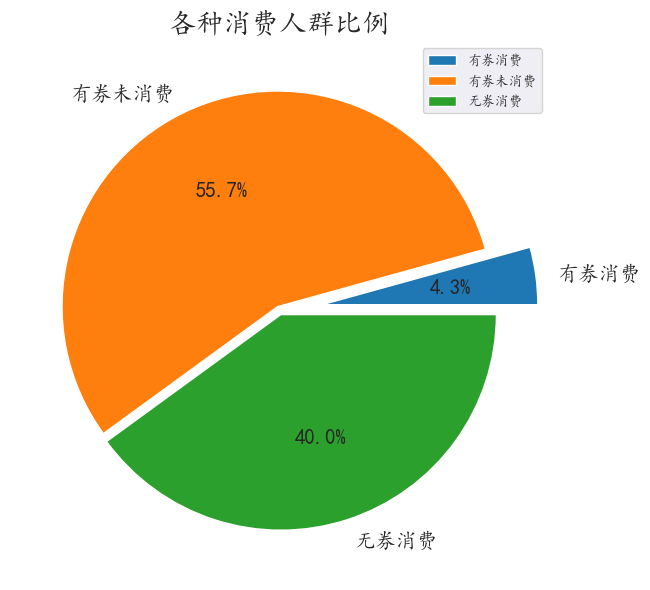
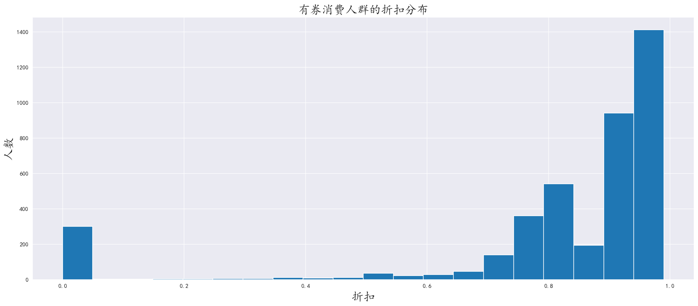
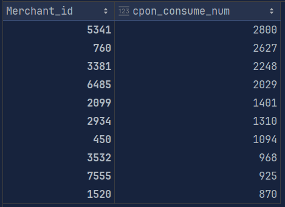
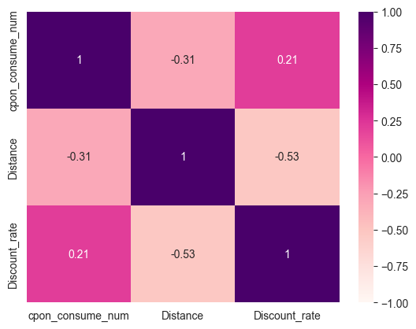
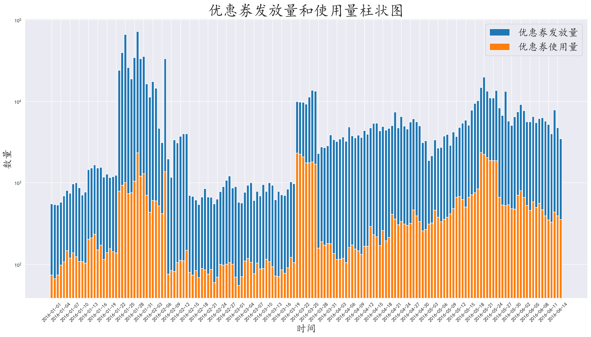
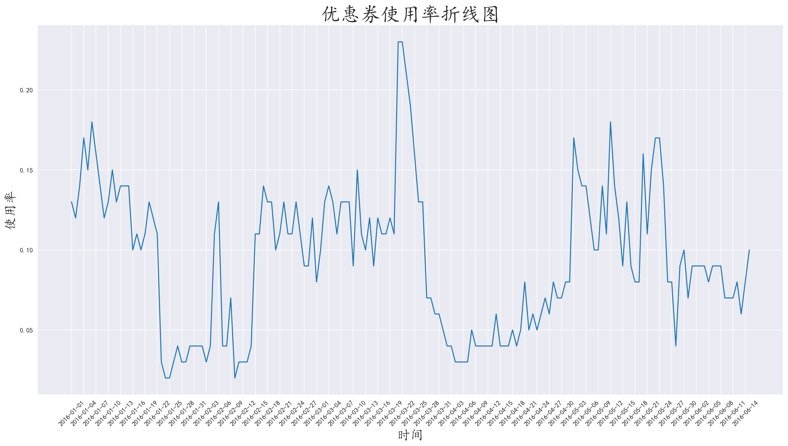

## 1. 需求分析

一大型购物广场提供O2O模式下，客户优惠券使用数据，分析客户行为，以及优惠券发放建议

<!-- more -->

## 2.技术栈

#### 2.1 开发环境

- **操作系统**：Windows 11

- **开发工具**：Jupyter Notebook，PyCharm

- **版本控制**：Git

#### 2.2 编程语言和库

- **Python**：主要编程语言
  - **Pandas**：数据处理和分析
  - **Numpy**：数值计算
  - **Matplotlib**：数据可视化
  - **seaborn**：数据可视化

#### 2.3 数据存储

- **CSV**：平面文件存储

#### 2.4 报告生成

- **Markdown**：编写文档和报告

## 3.数据分析

### 3.1 认识数据

数据存储在CSV中，共175万条数据，数据量很大，数据中有用户ID，商家ID，优惠券的ID，折扣，距离，发放优惠券日期，和使用日期

我们发现，优惠券ID、折扣、发放优惠券日期，三者共存亡，但是只是猜测，实际需要验证

而折扣部分的单位不统一，有满减的，也有折扣，需要统一

时间类型可以在读取数据时就将其转为datetime

### 3.2 编程库导入和语言设置

```py
import pandas as pd
import numpy as np
import matplotlib.pyplot as plt
import matplotlib
import seaborn as sns

matplotlib.rc('font', family='KaiTi')
```

### 3.3 数据导入和数据清洗

使用read_csv导入时顺便将时间转为datetime类型

```py
pd.read_csv(filename, parse_dates=时间列)
```

判断优惠券ID、折扣、发放优惠券日期三者是否一一对应

```py
# 若输出为true则Coupon_id，Discount_rate，Date_received存在一一对应关系
print(np.all([df['Coupon_id'].isnull() == df['Discount_rate'].isnull(), df['Date_received'].isnull() == df['Coupon_id'].isnull(), df['Discount_rate'].isnull() == df['Date_received'].isnull()]))
```

```
# output:
True
# 输出为true说明三者存在一一对应关系，而在逻辑方面确实如此
```

折扣存在满减和普通折扣(如：30:5 和 0.8)，统一为普通折扣

对折扣一列使用map应用自定义函数

```py
def discount_transform(data):
    if ':' in data: # 满减
        data = data.split(':')
        data = (int(data[0]) - int(data[1])) / int(data[0])
        return data
    elif data == 'null':
        return np.nan
    else:
        return float(data[0])


df['Discount_rate'] = df['Discount_rate'].map(discount_transform).round(2)
```

### 3.4 对消费人群进行分析

消费人群有

- 有券但未消费
- 无券无消费
- 有券消费
- 无券消费

使用领券日期和使用日期进行区分，并新建一列存储用户类型

```py
# 如果Date == null & Coupon_id != null 表示 有优惠券，但没有消费 cpon_no_consume
# 如果Date == null & Coupon_id == null 表示 没有优惠券，也没有消费 no_cpon_no_consume
# 如果Date != null & Coupon_id != null 表示 有优惠券，使用了优惠券消费 cpon_consume
# 如果Date != null & Coupon_id == null 表示 没有优惠券，但仍然消费了 no_cpon_consume

def user_kinds_func(data):
    if pd.notnull(data.iloc[0]) & pd.isnull(data.iloc[1]):
        return 'cpon_no_consume'
    elif pd.isnull(data.iloc[0]) & pd.isnull(data.iloc[1]):
        return 'no_cpon_no_consume'
    elif pd.notnull(data.iloc[0]) & pd.notnull(data.iloc[1]):
        return 'cpon_consume'
    else:
        return 'no_cpon_consume'


df['user_kinds'] = df.loc[:, ['Coupon_id', 'Date']].apply(user_kinds_func, axis=1)
```

对用户种类分组聚合，使用饼图绘制分布图



发现这些客户中，大部分都是有优惠券但是没有来消费，而另外一部分是没有优惠券但是来消费了

对于有优惠券但没有来消费的客户，可以在优惠券发放之后一段时间进行积累优惠券兑换礼品，或者兑换更大优惠额度的优惠券，引导客户消费

对于无优惠券但是消费的客户，可以在其消费后发放下次消费的优惠券，或者加大优惠券发放力度，让这些客户也能收到优惠券

### 3.5 分析有券消费人群中的折扣力度

使用布尔索引对用户类型筛选，以优惠券ID进行分组聚合，进行数据可视化

```py
Merchant_discount = df[df['user_kinds'] == 'cpon_consume'].groupby('Merchant_id')['Discount_rate'].mean().round(2)
```



这些客户的优惠券都集中在八折以上的额度，其他额度人数较少，之后发放优惠券可以发放八折左右的优惠券

而在一折左右也有不少的顾客，说明他们是被极其大的优惠力度吸引来消费的，根据商家成本和其他因素考虑，是否要在八折优惠券的基础上，偶尔发放一折优惠券

### 3.6 分析持券消费用户最多的商家

取出持券消费的用户对他们进行分组聚合

```py
Merchant_cpon_consume_num = df[df['user_kinds'] == 'cpon_consume'].groupby('Merchant_id')['User_id'].apply(lambda x: len(x.unique())).sort_values(ascending=False)
```



我们发现前几名最多的商家都是有着接近3000名持券消费的用户

其他商家可以向前几名的商家学习营销经验

### 3.7 分析持券消费人数和距离、折扣的相关系数

使用corr(method)相关系数进行分析，method的参数如下：

- **pearson**：皮尔逊相关系数（默认）
- **kendall**：肯德尔秩相关系数
- **spearman**：斯皮尔曼秩相关系数
- **callable**：自定义

我们使用皮尔逊相关系数分析

```py
#corr(correlation:相关系数),用来计算df数据中列与列的相关性(皮尔逊相关系数)
#正相关:随着变量的增大,而增大,反之同理
#负相关:随着变量的增大,而减小,反之同理

MCCN_distance_discount_data.corr()
```

使用seaborn的热力图进行分析

```py
# 设置语言
plt.rcParams['font.family'] = 'Arial'

sns.heatmap(MCCN_distance_discount_data.corr(), cmap='RdPu', annot=True, vmin=-1, vmax=1)
```



我们发现，在持券消费人群中距离和折扣成较为明显的负相关

说明持券消费的人群，里商家越近，消费概率越大

### 3.8 分析优惠券发放数量和使用数量

分别统计每天优惠券的发放量和使用量，最后绘制在同一个图表

```py
# 统计每天使用优惠券的人数
everyday_consume = cpon_consume_data.groupby('Date_received')['User_id'].count()

# 统计每天发放优惠券的数量
send_cpon_num = df[df['Date_received'].notnull()].groupby('Date_received').size()

# 将两个数据组装在一起
send_used_data = pd.merge(send_cpon_num, everyday_consume, on='Date_received', how='left', suffixes=('_send', '_used'))
send_used_data['used_percent'] = (send_used_data['Count_used'] / send_used_data['Count_send']).round(2)
```



**这里使用了 plt.yscale('log') 将y轴的数值改为指数增长，由于优惠券的使用率很低，在图中观察不明显，这样可以使得数值相差很大的数据看着也很直观**



两张图反映了其实优惠券的使用率是不规律变化的，商家要做的就是在发放优惠券时，想办法将优惠券回收，像进行积累优惠券兑换礼品，兑换更大优惠的优惠券的活动，可能会增加优惠券的回收率。

## 4. 总结分析

**根据数据分析来看，得出以下几点：**

- 有券未用的用户占据大头，可以利用那些发放的优惠券，发起一定现金+优惠券积累兑换礼品的活动，增加优惠券回收率
- 而对于未使用优惠券进行消费的，可以加大优惠券的发放数量
- 而根据折扣来看，多发放八折左右的优惠券，商家也可以根据自身成本和具体情况，适当发放一些一折优惠券，吸引一些消费不积极的用户
- 而在距离上，对于距离近和距离远的客户，分别发放不同优惠券，距离远的优惠力度更大等等措施
